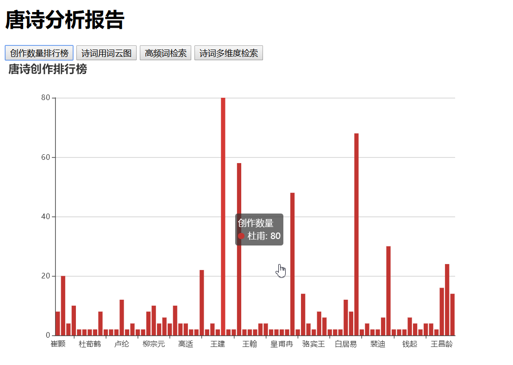

## 唐诗分析程序

### 1. 简介

唐诗分析程序主要是通过抓取互联网上的唐诗，然后进行数据的清洗，存储，数据分析，输出报告。

### 2. 背景

随着Java的发展，提供了流式处理（Stream）数据的能力，以及数据挖掘也是近年来比较热门的技术职业发展方向。通过初步学习，研究简单的数据采集，清洗，存储和分析，了解整个数据挖掘的基本流程。

### 3. 意义

+ 了解数据挖掘的基本流程
+ 熟悉数据分析方法
+ 锻炼应用技术解决问题的能力

### 3. 目标数据

数据采集主要来自：[古诗文网](https://www.gushiwen.org/)

### 4. 功能

+ 数据采集，清洗，存储
+ 数据分析，可视化展示

### 5. 技术

+ Stream流式处理
+ 文本分词和解决（`ansj`）
+ 多线程
+ 网络爬虫（`htmlunit`）
+ 数据库和JDBC编程
+ 数据可视化（`HTML/CSS/JavaScript`, `echarts`,`jQuery`）
+ SpringBoot快速构建web应用以及管理对象与配置信息

### 6. 实现

### 7. 分析结果

+ 唐诗创作数量排行

+ 唐诗用词云图

### 8. 部署运行

+ 打包
`mvn package -Dmaven.test.skip=true` 输出可执行程序`target/tangshi-analyze-1.0.0.jar`
+ 配置
`application.properties`
+ 运行-不启动爬虫
`java -jar tangshi-analyze-1.0.0.jar` 
+ 运行-启动爬虫 
`java -jar tangshi-analyze-1.0.0.jar crawler-run`

### 9. 参与开发

+ 下载源码 
    - `git clone https://gitee.com/secondriver/tangshi-analyze.git`
    - `cd tangshi-analyze`
+ 导入数据库
    - `mysql -u 数据库用户名 -p`
    - `source tangshi\tangshi.sql`
+ 配置修改
    - `src\main\resources\application.properties`
    - `spring.datasource.username=数据库用户名`
    - `spring.datasource.password=数据库密码`
+ 开发功能
    - `src\main\java\com.bittech.tangshianalyze.TangshiAnalyzeApplication`程序入口
    - `src\main\java\com.bittech.tangshianalyze.crawler`爬虫部分
    - `src\main\java\com.bittech.tangshianalyze.analyze`数据分析
    - `src\main\java\com.bittech.tangshianalyze.web`Web接口