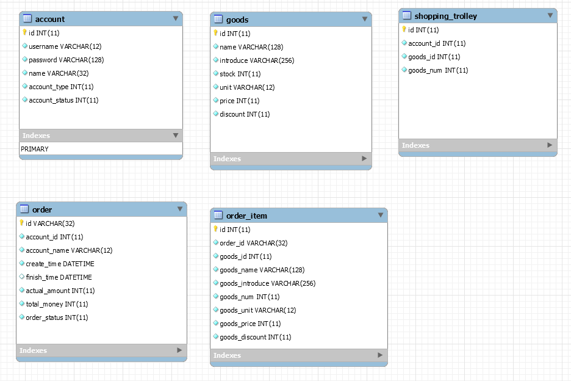
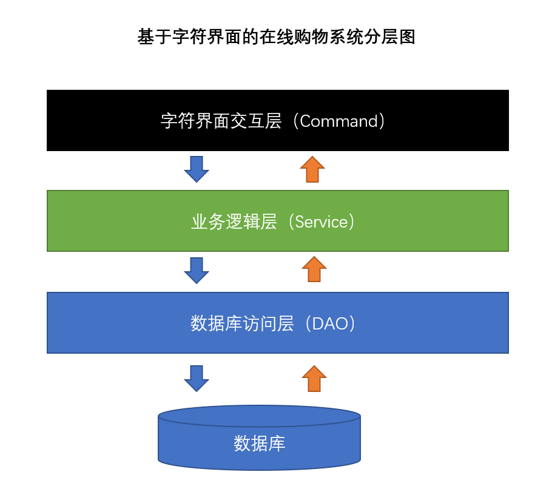
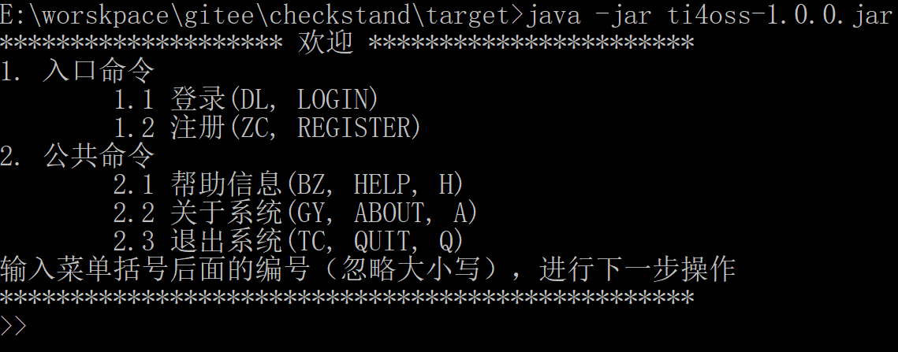
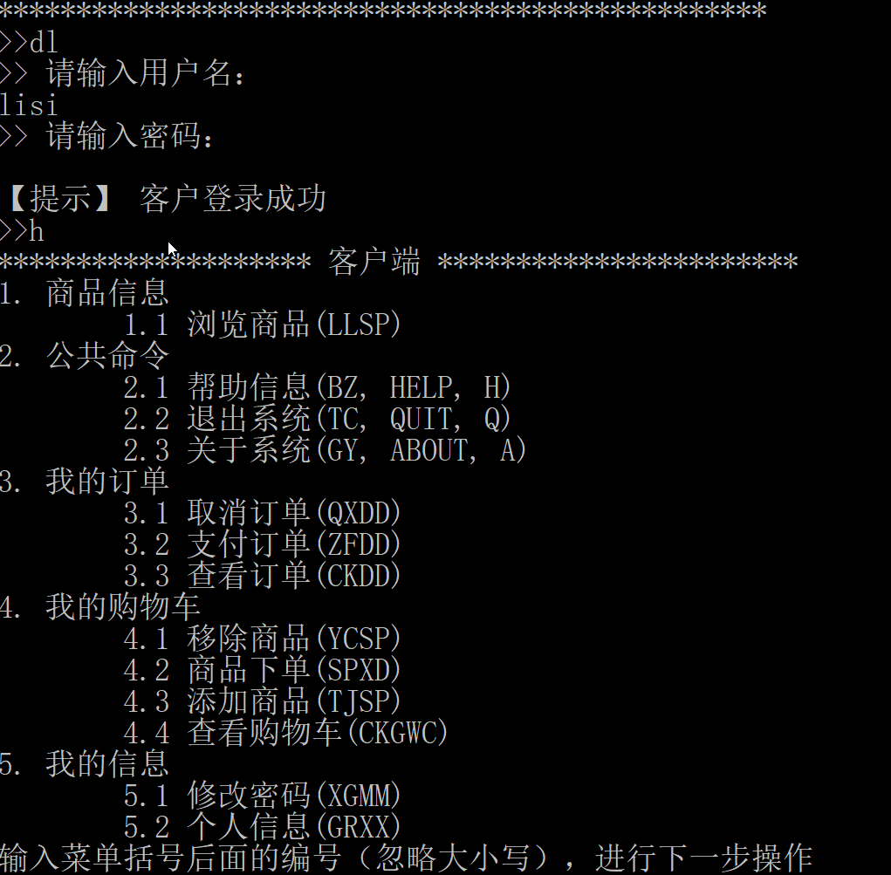
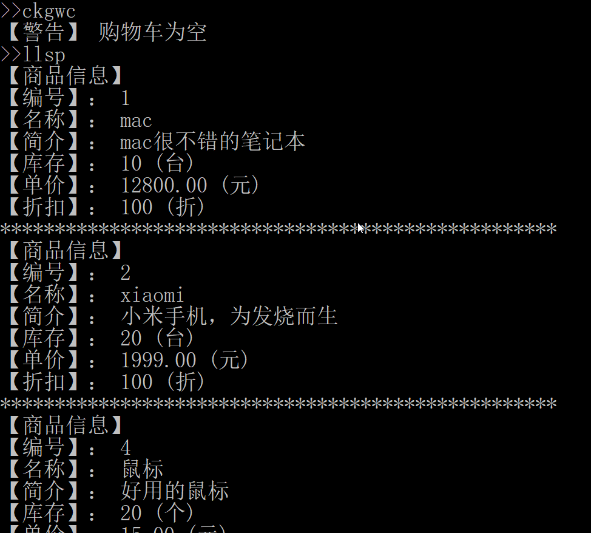
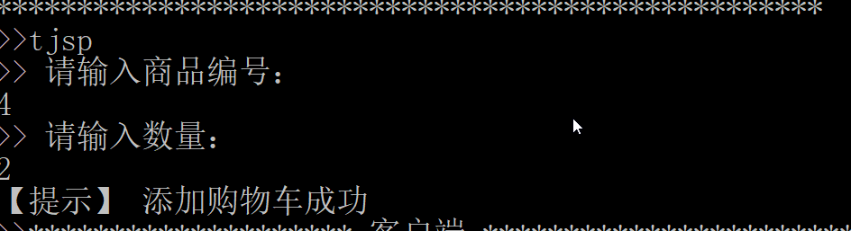
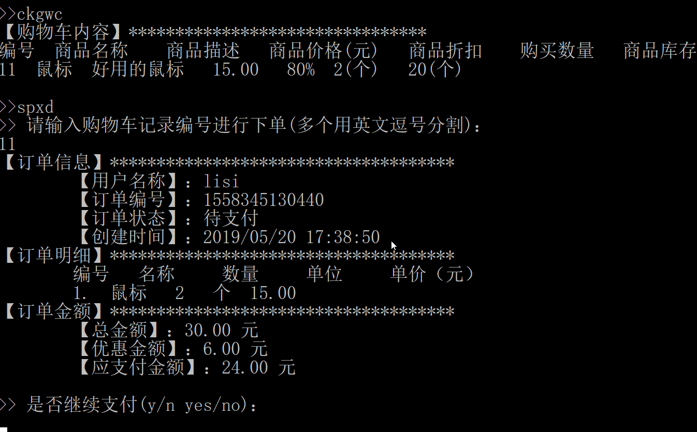

## 基于字符界面的在线购物系统

### 1. 简介

该系统是一款纯字符界面的购物系统，基本实现了购物网站最核心的功能，商品管理，浏览，购物车，下单，支付功能。

### 2. 背景

在掌握了JavaSE的基本知识，以及MySQL数据库，JDBC编程，为了能够将所学知识结合起来，但是又不具备前端知识的情况下，通过模仿已有成熟的购物系统，构建的一款纯字符界面的购物系统。

### 3. 意义

+ JavaSE知识的实践
+ 培养数据库编程的能力
+ 锻炼应用已有技术解决实际问题
+ 培养业务分析到技术实现的能力

### 4. 核心需求

+ 登录注册
+ 管理端
    + 用户管理
    + 商品管理
+ 用户端
    + 商品浏览
    + 购物车管理
    + 订单管理
    + 下单支付

### 5. 功能列表

#### 5.1  公共端

```
1. 入口命令
	1.1 登录(DL, LOGIN)
	1.2 注册(ZC, REGISTER)
2. 公共命令
	2.1 帮助信息(BZ, HELP, H)
	2.2 关于系统(GY, ABOUT, A)
	2.3 退出系统(TC, QUIT, Q)
```
#### 5.2 管理端

```
1. 帐号信息
	1.1 启停帐号(QTZH)
	1.2 重置密码(CZMM)
	1.3 查看帐号(CKZH)
2. 商品信息
	2.1 上架商品(SJSP)
	2.2 下架商品(XJSP)
	2.3 浏览商品(LLSP)
	2.4 更新商品(GXSP)
3. 公共命令
	3.1 帮助信息(BZ, HELP, H)
	3.2 关于系统(GY, ABOUT, A)
	3.3 退出系统(TC, QUIT, Q)
4. 我的信息
	4.1 修改密码(XGMM)
	4.2 个人信息(GRXX)
```

#### 5.3 用户端

```
1. 商品信息
	1.1 浏览商品(LLSP)
2. 公共命令
	2.1 帮助信息(BZ, HELP, H)
	2.2 退出系统(TC, QUIT, Q)
	2.3 关于系统(GY, ABOUT, A)
3. 我的订单
	3.1 取消订单(QXDD)
	3.2 支付订单(ZFDD)
	3.3 查看订单(CKDD)
4. 我的购物车
	4.1 移除商品(YCSP)
	4.2 商品下单(SPXD)
	4.3 添加商品(TJSP)
	4.4 查看购物车(CKGWC)
5. 我的信息
	5.1 修改密码(XGMM)
	5.2 个人信息(GRXX)
```

### 6. 涉及技术

+ 集合框架
+ 注解技术
+ Stream式编程
+ MySQL数据库
+ JDBC编程

### 7. 技术实现

#### 7.1 数据库设计



``` sql
drop table if exists `account`;
create table if not exists `account`
(
    id             int primary key auto_increment comment '帐号编号',
    username       varchar(12)   not null comment '帐号',
    password       varchar(128)  not null comment '密码',
    name           varchar(32)   not null comment '姓名',
    account_type   int default 1 not null comment '帐号类型 1 管理员 2 客户',
    account_status int default 1 not null comment '帐号状态 1 启用   2 锁定'
);

-- 商品信息
drop table if exists `goods`;
create table if not exists `goods`
(
    id        int primary key auto_increment comment '商品编号',
    name      varchar(128)              not null comment '商品名称',
    introduce varchar(256) default '暂无' not null comment '商品简介',
    stock     int                       not null comment '商品库存',
    unit      varchar(12)               not null comment '库存单位',
    price     int                       not null comment '商品价格，单位：分',
    discount  int          default 100  not null comment '商品折扣，[0,100]'
);

-- 购物车
drop table if exists `shopping_trolley`;
create table if not exists `shopping_trolley`
(
    id         int primary key auto_increment comment '购物车记录编号',
    account_id int not null comment '帐号编号',
    goods_id   int not null comment '商品编号',
    goods_num  int not null comment '商品数量'
);

-- 订单
drop table if exists `order`;
create table if not exists `order`
(
    id            varchar(32) primary key comment '订单编号',
    account_id    int         not null comment '帐号编号',
    account_name  varchar(12) not null comment '帐号',
    create_time   datetime    not null comment '创建时间',
    finish_time   datetime default null comment '完成时间',
    actual_amount int         not null comment '实际金额，单位：分',
    total_money   int         not null comment '总金额，单位：分',
    order_status  int         not null comment '支付状态 1 待支付 2 完成'
);
-- 订单项
drop table if exists `order_item`;
create table if not exists `order_item`
(
    id              int primary key auto_increment comment '订单条目编号',
    order_id        varchar(32)               not null comment '订单编号',
    goods_id        int                       not null comment '商品编号',
    goods_name      varchar(128)              not null comment '商品名称',
    goods_introduce varchar(256) default '暂无' not null comment '商品简介',
    goods_num       int                       not null comment '商品数量',
    goods_unit      varchar(12)               not null comment '库存单位',
    goods_price     int                       not null comment '商品价格，单位：分',
    goods_discount  int          default 100  not null comment '商品折扣，[0,100]'
);

```

数据库设计中`订单表`一条记录对应`订单项表`中n条记录，属于1对n的关系。

#### 7.2 分层设计



### 8. 效果图







### 9. 打包运行

+  执行`mvn package`打包，输出`target\ti4oss-1.0.0.zip`
+  解压`ti4oss-1.0.0.zip`，在数据库中执行数据库脚本`import.sql`
+  执行`java [-Dhost=<数据库地址>]  [-Dport=<数据库端口号>] [-Duser=<用户名>] [-Dpassword=<密码>]   -jar ti4oss-1.0.0.jar`
    + 数据库地址默认：`127.0.0.1`
    + 数据库端口号默认：`3306`
    + 数据库用户名：`root`
    + 数据库用户密码：`root`
    


